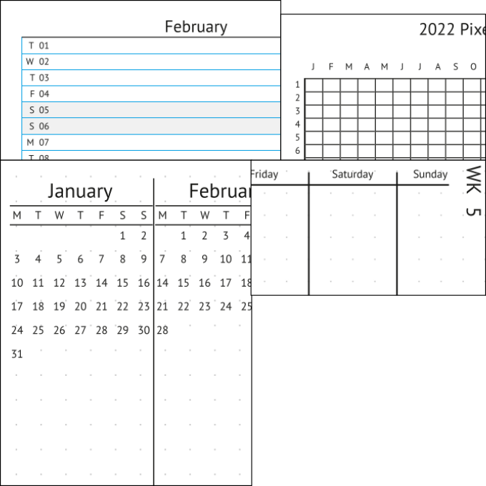

# Annual Bullet Journal
Scribus Template for an Annual Bullet Journal, to be bound in hand. 

The template uses the PT Sans font which can be downloaded [from Paratypes webpage](https://company.paratype.com/pt-sans-pt-serif).

## Contents

 * Annual Overview of 2022 with space for comments. (Futurelog)
 * 2022 in pixels (for tracking)
 * Monthly log for each month of 2022.
 * Weekly log for each week of 2022.
 * Extra pages for drawing/writing daily notes.
 
 
## How to use

 1. Download the zip file from Github.
 1. If you want to get the bullet journal as is, print the signatures provided as pdf in the signatures folder.
 1. Otherwise, open the sla.gz file with Scribus, make changes to your needs and export a PDF. Use an imposition tool like [BookBinder](http://quantumelephant.co.uk/bookbinder/bookbinder.html) to assemble the PDF in a binding-ready format.
